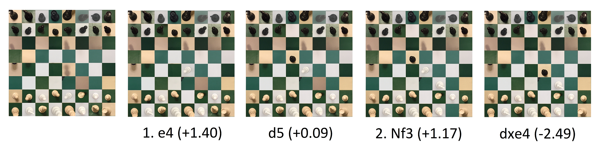

# Önálló labor és szakdolgozat - Gépi látáson alapuló sakkelemző alkalmazás

## Haladási napló

## 2021/22/2

### 2. hét

Megnéztem és elolvastam a kapott ML Kitet ismertető anyagot, átnéztem a példaprogram forráskódját, majd telefonon is lefuttattam. Itt-ott végeztem néhány kisebb módosítást (például, hogy az elülső kamerát használja az alkalmazás a hátsó helyett a könnyebb tesztelhetőség érdekében), valamint kibővítettem az alkalmazást azzal, hogy TTS motor segítségével ejtse ki annak a testrésznek a nevét, amihez a felhasználó hozzáér a bal mutatóujjával - például jobb váll, ball váll, orr, száj jobb széle, stb. Ez a funkció egyelőre szeszélyesen működik, javításokra szorul még.

### 3. hét

Kezdésképpen letöltöttem és futtattam az [ML Kit Vision Quickstart Sample App](https://github.com/googlesamples/mlkit/tree/master/android/vision-quickstart) és az [ML Kit Vision Showcase App with Material Design](https://github.com/googlesamples/mlkit/tree/master/android/material-showcase) alkalmazást, majd tanulmányoztam főleg az előbbi forráskódját, de később majd az utóbbiéra is szeretnék időt szánni.

Még az előző hétről maradt meg az a problémám, hogy a *PreviewView* sehogyan sem jelent meg megfelelően, csak a képernyő felső felén, összenyomottan - emulátoron és igazi telefonon kipróbálva is ezt tapasztaltam. Ennek a megoldásával a vártnál több időt töltöttem, végül kiderült, hogy a probléma oka a manifest fájlban rejtőzött, ki kellett törölnöm a ```android:hardwareAccelerated="false"``` szöveget tartalmazó sort.

Ezután kiegészítettem az alkalmazást objektumfelismeréshez és -követéshez szükséges kódrészletekkel és osztályokkal. Ezek a telefon kameráját használva felismernek bizonyos objektumokat, majd különböző színű téglalapokkal jelzik az objektumok befoglaló téglalapjait, az ugyanahhoz az objektumhoz tartozó befoglaló doboz színe nem változik a kamera mozgatása során, ehhez szükség volt az ML Kit objektumkövető képességére is.

A következő kiegészítés az ML Kitnek egy másik felhasználási lehetőségét tesztelte: letöltöttem TensorFlow Hubról egy TensorFlow Lite modellt, ami képes felismerni ismert európai látványosságokat, épületeket. Ezt beépítettem az alkalmazásba, így az folyamatosan kiírta a képernyő közepére, hogy éppen milyen látványosságot vél leginkább felismerni a kamera képén. Ezt sikeresen teszteltem is azzal, hogy a monitoromon megjelenítettem többek között a Buckingham-palotát és a Trevi-kutat, ezeket mind sikeresen felismerte az általam használt előre betanított hálózat.

### 4-5. hét

A célom egy madarakat beazonosító neurális háló betanítása volt TensorFlow Lite Model Maker segítségével. Ehhez elolvastam a [dokumentációját](https://www.tensorflow.org/lite/guide/model_maker), leginkább a képosztályozásról szóló fejezeteket. Ezután kerestem Kaggle-ön egy [megfelelő képgyűjteményt](https://www.kaggle.com/datasets/gpiosenka/100-bird-species) a tanításhoz. A tanítást Google Colabbal végeztem el: először közvetlenül próbáltam meg feltölteni a képeket, viszont ez túlságosan lassúnak bizonyult, ráadásul a futtatókörnyezettel meglévő kapcsolat is megszakadt többször egymás után, így másik megoldást kellett keresnem, itt jött be a képbe a Kaggle API-ja, ez már gyorsan és kifogástalanul működött. A teljes tanítást tartalmazza a *BirdClassification.ipynb* nevű fájl, ebben látható, hogy 90%-os pontosságot ért el a mesterséges intelligencia. Alkalmazásban kipróbálva egy fizikai készüléken még nem működik, ez feltételezhetően a még nem megfelelően beállított metaadatok miatt van.

### 6. hét

Kiderült, hogy csak azért nem működött előző héten az alkalmazásban a madarak beazonosítása, mert túl magasra volt állítva a magabiztossági küszöb (*confidence threshold*), ezt lejjebbvéve már működött is a program. Ezután átírtam az alkalmazást, hogy ezt a neurális hálót ne képosztályozáshoz használja, hanem objektumfelismeréshez és -követéshez, valamint hogy helyesen jelenítse meg a felismert objektumok körülvevő téglalapjait, és ki is írja, hogy milyen madárnak véli felismerni az adott képrészletet. Tesztelésképpen egymás mellé bevágtam 16-szor ugyanazt a képet egy cifra récéről, hogy megtudjam azt, hogy hány objektumot tud egyszerre detektálni az alkalmazás.

<p align="center">
  
</p>

5-nél többet sehogyan sem tud felismerni az alkalmazás, ez a szám az ML Kit korlátja.

Következő lépésként készítettem közel 250 képet az egyik otthoni sakk-készletemről, feltöltöttem Kaggle-re, majd megpróbáltam betanítani egy neurális hálót a bábuk felismerésére (*ChessPieceClassification.ipynb*), de ennek épphogy 50% fölött lett csak a pontossága sajnos, habár legalább a bábuk színét minden egyes esetben helyesen ítélte meg. Az alkalmazásba beépítve a kiexportált modellt sajnos rosszabb eredmények születtek, mint amiket vártam volna a Colabon tapasztaltak után, de vannak ötleteim a hatékonyság növelésére.

### 8. hét

A TensorFlow Lite Model Maker dokumentációját olvasva láttam, hogy objektumok felismerésére és követésére máshogyan ajánlott modellt betanítani, mint egyszerű képosztályozáshoz, de én eddig csak az utóbbi módszert alkalmaztam a betanításnál, amihez a saját datasetemet használtam, ezért az előbbi módot is ki akartam próbálni, ahhoz viszont egy CSV fájlban meg kell adni minden egyes képhez tartozóan a rajta lévő objektumokat és a befoglaló téglalapjaiknak a koordinátáit, így inkább megnéztem milyen publikusan elérhető képgyűjtemények léteznek már a sakkbábu-felismerés problémájára.

[Találtam is egyet](https://public.roboflow.com/object-detection/chess-full), amihez az előbb említett módon megvoltak a befoglaló téglalapoknak a koordinátái is, habár a formátum nem volt megfelelő, ezért a CSV-t manuálisan is kellett szerkesztenem, hogy a Model Maker elfogadja (*annotations.csv*). Miután ez sikerült, a *ChessPieceDetector.ipynb*-ban látható módon betanítottam a hálózatot. Ezután tesztelni akartam fizikai készüléken a modellt, viszont ekkor derült ki, hogy sajnos félreértettem az ML Kit képességeit, mert a modellre hibát dobott, mégpedig azért, mert az ML Kites objektumdetekció csak saját képosztályozó neurális háló használatát támogatja, teljes objektumdetektálást és még osztályozást is végző modellt pedig nem.

Így ezek után egy [harmadik datasethez](https://www.dropbox.com/s/618l4ddoykotmru/Chess%20ID%20Public%20Data.zip) fordultam, amiben sajnos DS_STORE fájlok is voltak, ami egy kis kellemetlenséget okozott a Colab használatakor, de ezen hamar túllendültem. Ismét csak egy képosztályozó modellt tanítottam be ezekkel az újonnan talált képekkel (*ChessPieceClassificationPublicImages.ipynb*), a kapott pontosság pedig lényegesen jobb lett, mint amit a saját képeimet használva sikerült elérni.

(Ezután tettem egy kis kitérőt: egy olyan GitHubon talált Python kódot próbáltam ki, ami tetszőleges képről automatikusan kivágja és perspektivikusan átméretezi a képen lévő sakktáblát; ebben a kódban, és néhány egyéb cikkben láttam, hogy mi a legtöbbet alkalmazott algoritmus egy sakktábla felismerérése egy képen, ezt majd később fel tudom használni, amikor ehhez a részhez érek az alkalmazásomban.)

Végül elkezdtem írni egy új alkalmazást Chess Analyzer néven, ez futtatáskor elindítja a beépített kamera alkalmazást, majd miután fotóztunk egyet (felülről kell lefotózni a sakktáblát úgy, hogy annak szélessége megegyezzen a képernyő szélességével, valamint a tábla felső fele a képernyő tetejénél legyen), a friss képet feldarabolja a sakktábla mezői mentén, majd a mezőket egyesével elküldi feldolgozásra a képosztályozó neurális hálónak, a háló kimeneteiből pedig felépít egy sakktábla objektumot.

### 9-10. hét

Folytattam a Chess Analyzer alkalmazás írását: megoldottam a prolémát, ami miatt hibát dobott az alkalmazás (túl kicsi volt a Bitmap, amit elemeztetni akartam a neurális hálóval, mivel mint kiderült számomra, az onActivityResult függvényben megkapott Intentből elérhető Bitmap nem a teljes fotót adja vissza, hanem csak egy kis felbontású változatot belőle). A teljes képet elmentve és használva már jól működött az alkalmazás, ezután a felhasználói felülettel kezdtem el foglalkozni. [Ebben a repository-ban](https://github.com/jj30/ChessPGNHelper/tree/master/app/src/main/java/bldg5/jj/pgnbase) találtam megfelelő XML fájlokat a sakkbábukhoz és a sakktáblához. Mostani állapotában az applikáció ugyanazt elvégzi, mint amit az előző hét utolsó bekezdésében leírtam, viszont már nem csak felépít egy sakktábla objektumot a memóriában, hanem kirajzolja a táblát a bábukkal együtt. Ezután az egyes mezőkre nyomva megváltoztathatjuk a rajtuk lévő bábukat, így lehet kijavítani a mesterséges intelligencia tévedéseit.

### 11. hét

Kijavítottam néhány kisebb meglévő hibát a felhasználói felülettel kapcsolatban, majd nekiálltam a Stockfish engine integrálásának, hogy ki lehessen értékelni az egyes állásokat az alkalmazásban. Ez sokkal több időt vett igénybe mint gondoltam, nem volt egyértelmű leírás sehol sem, hogy hogyan kell ezt elvégezni, két-három alkalommal is hosszabb időre elakadtam, de végül mindegyik akadályt sikerült leküzdeni. Egy natív C++ projektet hoztam létre StockfishforChessAnalyzer néven, ahova átmásoltam a Stockfish motor fájljait, ezután lebuildeltem a projektet, így aztán olyan futtatható állományokat kaptam, amiket a Chess Analyzer alkalmazás fel tud, gyakorlatilag egy bájtfolyamon keresztül lehet kommunikálni az alkalmazáson belül a Stockfish-sel, az UCI-nak (Universal Chess Interface) megfelelő módon. Most már van az appban egy (*Analyze*) gomb is, aminek hatására a Stockfish megkapja a programban tárolt sakktábla aktuális állapotát FEN (Forsyth–Edwards Notation) formátumban (ehhez írtam egy átalakító függvényt), az állás alapján pedig visszaadja, hogy melyik játékos áll éppen jobban, és hogy mennyivel.

<p align="center">
  
</p>

Debugolás közben kiderült az is, hogy valami nem jó a kép feldarabolását végző kódban, ezért összevissza kerülnek feldolgozásra, jövőhétre ezt kellene orvosolni, valamint hatékonnyá tenni a detekciót.

### 12. hét

Az előző héten észrevett, képfeldarabolással kapcsolatos hibát kijavítottam, ezután azzal kezdtem foglalkozni, hogy jobb legyen a felismerést végző neurális háló. Újratanítottam sokféle különböző beállítással, de a végeredmény mindig ugyanaz lett: Colabon a tesztképeket elvileg nagy pontossággal felismeri (bár a modellen hívott *evaluate* függvény rosszabb eredményt mutat), viszont az alkalmazásban kipróbálva már bőven nem kielégítő az eredmény. Jól azonosítja azokat a mezőket, amiken bábu áll, a bábu színét is nagyrészt eltalálja, de hogy pontosan milyen bábu van ott, azt már nem igazán tudja megállapítani, ezen sajnos minden igyekezetem ellenére sem sikerült javítani.
Ezenkívül annyi változtatást eszközöltem, hogy választógombokkal meg lehet adni, hogy melyik színű játékos következik az adott állásnál, erre a kiértékeléshez van szükség, valamint az elemzésnél már a soron következő játékos optimális lépését is kiírja.

### 13-14. hét

Újratanítottam a neurális hálózatot, majd teszteltem a hatékonyságát, ekkor derült ki, hogy a felismerés jól működik, csak nem a saját otthoni sakk-készletemmel, mert nem hasonlít eléggé arra a készletre, amivel betanítottam. Emiatt vettem olyan sakkbábukat, amik ugyanúgy néztek ki, innentől már sokkal jobban működött a felismerés.
Hozzáadtam az alkalmazáshoz egy új módot, ami folyamatosan elemzi a kamerától kapott képet és kiírja egy fájlba a beazonosított állást FEN (Forsyth–Edwards Notation) formátumban, ha az előző azonosított álláshoz képest történt változás. Készítettem egy főmenüt, ahol a két meglévő mód közül lehet választani, illetve az alkalmazás kinézetét véglegesítettem, a kódot és az architektúrát javítottam. Az alkalmazás ikonjának forrása a [Freepik](https://www.flaticon.com/free-icons/chess).

<p align="center">


</p>

## 2022/23/1

## Tervezett funkciók
* A sakkjátszmák standard lejegyzését alkalmazni Recorder módban (standard algebraic notation)
* A neurális háló javítása
* ~~Szabványos, játékokban előforduló rajzolt sakkbábuk felismerése~~
* Automatikus sakktábla-detekció
* Az analyzer mód továbbfejlesztése, a Stockfish motor jobb kihasználása
* Dizájn javítása

### 2-3. hét

A sakktáblát reprezentáló osztályt kiegészítettem egyéb függvényekkel, amelyek például megállapítják, hogy két sakktábla állása teljesen ugyanaz-e, illetve hogy csak egy lépésnyi különbség van-e a két állás között. Szintén egy újabb függvényt írtam a legutóbb megtett lépés megfelelő formátumba (standard algebraic notation) való konvertálására.
Ez utóbbit használom fel az alkalmazás játszmát rögzítő módjában.
Ezenkívül hozzáadtam a projekthez új osztályokat:
* Analysis - egy sakkmotoros elemzés eredményét tartalmazza
* Step - egy sakktábla-állapotot kapcsol össze egy elemzés eredményével
* Round - tartalmaz két egymásutáni lépést, egyet a világos, egyet pedig a sötét játékostól
* Game - Egy sakkjátszma összes lépéséért felelős osztály

Ezenkívül egy új interfészt is létrehoztam, ami a Stockfish-sel történő kommunnikálást hivatott megkönnyíteni (AnalysisCompletedListener); a korábbiakban ezen a néven futó függvényt pedig átneveztem RecognitionCompletedListenerre.

### 4. hét

Előző héten nem maradt lehetőségem arra, hogy leteszteljem a megírt, SAN-ba (Standard Algebraic Notation) konvertáló függvényt, így ezt bepótoltam. Rengeteg apró hibába ütköztem, amelyek javítása, majd a helyesség folytonos újbóli ellenőrzése jóval több időt vett igénybe, mint amennyire számítottam előtte. Az alábbi ábrán látható, hogy egy példa bemenet-sorozatra milyen leírás jön létre az alkalmazásban Recorder módban.

<p align="center">
  
</p>

### 5. hét

Ezen a héten az Analyzer mód bővítésének álltam neki, ehhez először is egy megfelelő API-t próbáltam keresni, amiből egyszerűen kinyerhető például, hogy egy adott sakkállás mikor és mely nagymesterek játszmája közben fordult már elő korábban. A célnak legmegfelelőbbnek a [Lichess API](https://lichess.org/api#tag/Opening-Explorer)-t találtam, ennek segítségével azt is megtudhatjuk, hogy - amennyiben van - mi a neve az adott állásnak, és hogy hányszor szerepel az adott állás az adatbázisukban, illetve ezekhez a játszmákhoz milyen végeredmények társulnak (hányszor nyert a fehér, hányszor nyert a fekete, hányszor lett döntetlen). Az API-val való kommunikációhoz létrehoztam a LichessApi interfészt és a LichessInteractor osztályt, valamint a PositionInfo osztályt a kinyert adatok tárolásához.
Egy kellemetlen velejárója az API-nak, hogy a sáncolási szabályok miatt legrosszabb esetben akár 16 hívást is kell kezdeményezni egyetlen álláshoz, de ez szerencsére nem rontja le érezhetően az alkalmazás teljesítményét.

A kapott plusz adatok felhasználói felületen való megjelenésén is elkezdtem dolgozni, ez viszont jelenleg is csak félkész állapotban van.

### 6. hét

A főmenüben elhelyeztem egy harmadik gombot, ami így lehetővé teszi, hogy ne csak fotózni lehessen egy képet és azt elemeztetni a Stockfish-sel, hanem tetszőleges képet is meg tudjunk nyitni a galériából választva.

Ezenkívül befejeztem az előző héten még csak félkész állapotig jutó megjelenítését az API-ról nyert adatoknak, illetve megváltoztattam az egész alkalmazás színeit, dizájnját.

### 7. hét

Hozzáadtam a főmenühöz egy negyedik gombot is - ez a *Sandbox* mód, amire nyomva rögtön egy alaphelyzetben lévő sakktábla jelenik meg, vagyis ebben a módban semmiféle bábuazonosítás nem történik.

Az egyes mezők bábuit mostantól nem a mezők megfelelő számú megnyomásával lehet állítani, hanem ehelyett minden mező megnyomásakor egy dialógus jelenik meg az összes különböző bábuval, az itt választott bábu fog az eredendően megnyomott mezőre kerülni.

Ezenkívül javítottam a végső analízist megjelenítő dialóguson is, illetve amennyiben nincs a Lichess adatbázisában egy játszma sem az adott pozícióval, akkor egy egyszerűsített dialógus jelenik meg csak a Stockfish által visszaadott eredményekkel.

<p align="center">


</p>

Egyéb elvégzett kisebb-nagyobb javítások, fejlesztések:
* Az Analysis osztály kiegészítése a *bestResponse* attribútummal
* A Stockfish eredményeit most már minden azokat használó osztály az Analysis osztály egy példányaként kapja meg, az eredmény mindig pozitív előjelű, és látni lehet mellette, hogy melyik színű játékosnak van előnye
* Felesleges toast üzenetek törlése
* Már nem nyomhatóak meg a sakktábla mezői, amíg az *Analyzing* felirat van előtérben
* Az *Analyze* gomb megnyomása után bekövetkező kisebb képernyő-fagyás kiiktatása

### 8. hét

Elvégzett fejlesztések, hibajavítások:
* Az egyes mezőket most már üresre is lehet állítani (<a href="https://www.flaticon.com/free-icons/empty" title="empty icons">Empty icons created by Dreamstale - Flaticon</a>)
* onInvalidFen függvény hozzáadása az AnalysisCompletedListenerhez, ez az analizálós módban megjelenít egy dialógust, ami jelzi, hogy invalid a megadott állás
* Megfelelően kezelve van az internetkapcsolat hiánya is dialógussal
* Használható marad az alkalmazás egy invalid sakkállás megadása után is
* Felismeri a sakkot és a mattot is, ettől függően más elemzés jelenik meg
* Az Activityből kilépéskor jelentkező hibák javítása
* Néhány kisebb dizájnt érintő módosítás
* A sakktáblát elforgató gomb hozzáadása az Activityhez - szükség lehet rá, ha a sakktábla 90, 180, vagy 270 fokkal elforgatva lett lefotózva (<a href="https://www.flaticon.com/free-icons/reload" title="reload icons">Reload icons created by Royyan Wijaya - Flaticon</a>)

De a legnagyobb módosítás egyértelműen az automatikus sakktábla-detekció hozzáadása volt, ehhez integráltam az OpenCV-t az alkalmazásba, majd a felismeréshez a következő lépéseket alkalmaztam, ezekhez írtam függvényeket:
1. A kapott kép fekete-fehérré konvertálása
2. Elmosódás hozzáadása
3. Canny éldetektáló algoritmus
4. Vonalak felismerése Hough transzformációval
5. A vonalak metszéspontjainak meghatározása
6. A metszéspontok klaszterezése
7. A sakktábla sarokpontjainak meghatározása
8. Perspektivikus hajlítás és vágás

<p align="center">


</p>

<p align="center">


</p>

<p align="center">


</p>