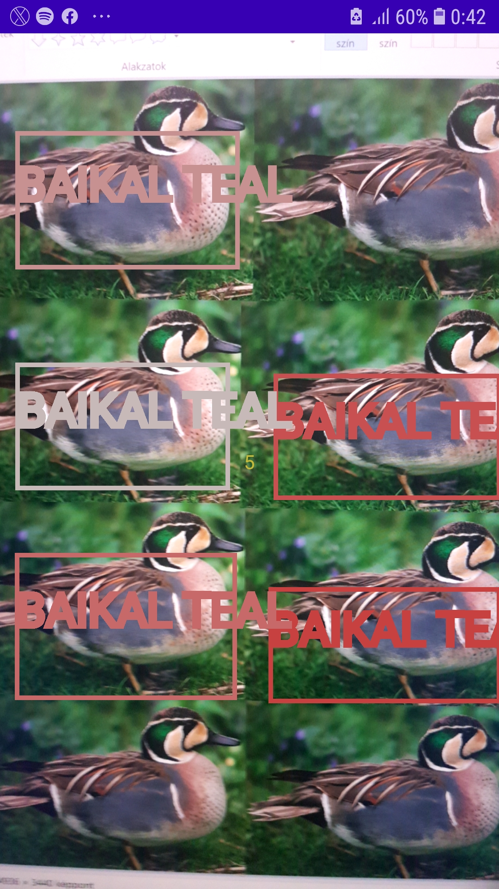

# Önálló labor

### Madáretető Tensor Flow alapú automatikus felismeréssel és fotózással

A téma célja az Android MLKit és a TensorFLow megismerése egy példaalkalmazáson keresztül.
Az alkalmazás célja, hogy egy (a fejlesztés során mobiltelefonnal szimulált) webkamerás Android egységgel felszerelt madáretető készítsünk, amely felismeri, ha madár szállt rá, azonosítja, és fotókat készít róla.

## Haladási napló

### 2. hét

Megnéztem és elolvastam a kapott ML Kitet ismertető anyagot, átnéztem a példaprogram forráskódját, majd telefonon is lefuttattam. Itt-ott végeztem néhány kisebb módosítást (például, hogy az elülső kamerát használja az alkalmazás a hátsó helyett a könnyebb tesztelhetőség érdekében), valamint kibővítettem az alkalmazást azzal, hogy TTS motor segítségével ejtse ki annak a testrésznek a nevét, amihez a felhasználó hozzáér a bal mutatóujjával - például jobb váll, ball váll, orr, száj jobb széle, stb. Ez a funkció egyelőre szeszélyesen működik, javításokra szorul még.

### 3. hét

Kezdésképpen letöltöttem és futtattam az [ML Kit Vision Quickstart Sample App](https://github.com/googlesamples/mlkit/tree/master/android/vision-quickstart) és az [ML Kit Vision Showcase App with Material Design](https://github.com/googlesamples/mlkit/tree/master/android/material-showcase) alkalmazást, majd tanulmányoztam főleg az előbbi forráskódját, de később majd az utóbbiéra is szeretnék időt szánni.

Még az előző hétről maradt meg az a problémám, hogy a *PreviewView* sehogyan sem jelent meg megfelelően, csak a képernyő felső felén, összenyomottan - emulátoron és igazi telefonon kipróbálva is ezt tapasztaltam. Ennek a megoldásával a vártnál több időt töltöttem, végül kiderült, hogy a probléma oka a manifest fájlban rejtőzött, ki kellett törölnöm a ```android:hardwareAccelerated="false"``` szöveget tartalmazó sort.

Ezután kiegészítettem az alkalmazást objektumfelismeréshez és -követéshez szükséges kódrészletekkel és osztályokkal. Ezek a telefon kameráját használva felismernek bizonyos objektumokat, majd különböző színű téglalapokkal jelzik az objektumok befoglaló téglalapjait, az ugyanahhoz az objektumhoz tartozó befoglaló doboz színe nem változik a kamera mozgatása során, ehhez szükség volt az ML Kit objektumkövető képességére is.

A következő kiegészítés az ML Kitnek egy másik felhasználási lehetőségét tesztelte: letöltöttem TensorFlow Hubról egy TensorFlow Lite modellt, ami képes felismerni ismert európai látványosságokat, épületeket. Ezt beépítettem az alkalmazásba, így az folyamatosan kiírta a képernyő közepére, hogy éppen milyen látványosságot vél leginkább felismerni a kamera képén. Ezt sikeresen teszteltem is azzal, hogy a monitoromon megjelenítettem többek között a Buckingham-palotát és a Trevi-kutat, ezeket mind sikeresen felismerte az általam használt előre betanított hálózat.

### 4-5. hét

A célom egy madarakat beazonosító neurális háló betanítása volt TensorFlow Lite Model Maker segítségével. Ehhez elolvastam a [dokumentációját](https://www.tensorflow.org/lite/guide/model_maker), leginkább a képosztályozásról szóló fejezeteket. Ezután kerestem Kaggle-ön egy [megfelelő képgyűjteményt](https://www.kaggle.com/datasets/gpiosenka/100-bird-species) a tanításhoz. A tanítást Google Colabbal végeztem el: először közvetlenül próbáltam meg feltölteni a képeket, viszont ez túlságosan lassúnak bizonyult, ráadásul a futtatókörnyezettel meglévő kapcsolat is megszakadt többször egymás után, így másik megoldást kellett keresnem, itt jött be a képbe a Kaggle API-ja, ez már gyorsan és kifogástalanul működött. A teljes tanítást tartalmazza a *BirdClassification.ipynb* nevű fájl, ebben látható, hogy 90%-os pontosságot ért el a mesterséges intelligencia. Alkalmazásban kipróbálva egy fizikai készüléken még nem működik, ez feltételezhetően a még nem megfelelően beállított metaadatok miatt van.

### 6. hét

Kiderült, hogy csak azért nem működött előző héten az alkalmazásban a madarak beazonosítása, mert túl magasra volt állítva a magabiztossági küszöb (*confidence threshold*), ezt lejjebbvéve már működött is a program. Ezután átírtam az alkalmazást, hogy ezt a neurális hálót ne képosztályozáshoz használja, hanem objektumfelismeréshez és -követéshez, valamint hogy helyesen jelenítse meg a felismert objektumok körülvevő téglalapjait, és ki is írja, hogy milyen madárnak véli felismerni az adott képrészletet. Tesztelésképpen egymás mellé bevágtam 16-szor ugyanazt a képet egy cifra récéről, hogy megtudjam azt, hogy hány objektumot tud egyszerre detektálni az alkalmazás.

<p align="center">
  
</p>

5-nél többet sehogyan sem tud felismerni az alkalmazás, ez a szám az ML Kit korlátja.

Következő lépésként készítettem közel 250 képet az egyik otthoni sakk-készletemről, feltöltöttem Kaggle-re, majd megpróbáltam betanítani egy neurális hálót a bábuk felismerésére (*ChessPieceClassification.ipynb*), de ennek épphogy 50% fölött lett csak a pontossága sajnos, habár legalább a bábuk színét minden egyes esetben helyesen ítélte meg. Az alkalmazásba beépítve a kiexportált modellt sajnos rosszabb eredmények születtek, mint amiket vártam volna a Colabon tapasztaltak után, de vannak ötleteim a hatékonyság növelésére.